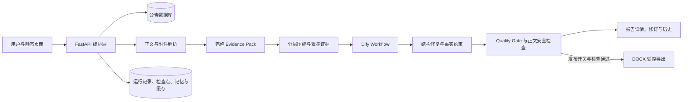

# Chinese AI-Oriented README Implementation Plan

> **For agentic workers:** REQUIRED SUB-SKILL: Use superpowers:subagent-driven-development (recommended) or superpowers:executing-plans to implement this plan task-by-task. Steps use checkbox (- [ ]) syntax for tracking.

**Goal:** Replace the root README with a Chinese-first, job-portfolio-oriented document that accurately explains the project's technology choices, capabilities, workflow, engineering boundaries, and prioritized AI/Agent roadmap.

**Architecture:** This is a documentation-only change on branch codex/readme-ai-engineer-20260720. README claims must be derived from the current main implementation and grouped as baseline capabilities, feature-gated capabilities, or future roadmap; all company network and personal environment details must be removed.

**Tech Stack:** Markdown, Mermaid, GitHub contents API, Python 3.11, FastAPI, Dify Workflow, MySQL, document parsing libraries, Docker Compose

---

## File Map

- Modify: README.md — public project overview, architecture, workflow, setup, APIs, limitations, and roadmap.
- Reference: docs/superpowers/specs/2026-07-20-readme-ai-engineer-design.md — approved content and claim-boundary specification.
- Reference: AGENTS.md — stable repository rules and verified architecture summary.
- Reference: requirements.txt — Python dependency source of truth.
- Reference: Dockerfile — Python and system dependency source of truth.
- Reference: docker-compose.yml — baseline runtime defaults and feature flags.
- Reference: docker-compose.s4-runtime.yml — S4 runtime overrides.
- Reference: app/main.py — routes, orchestration, run state, provider behavior, and feature gates.
- Reference: app/generation/base.py and app/generation/dify_generator.py — generator abstraction and current Dify implementation.
- Reference: tests/ — implemented behavior coverage; presence alone must not be described as a passing result.

### Task 1: Reconfirm the Branch Baseline

**Files:**
- Read: README.md
- Read: docs/superpowers/specs/2026-07-20-readme-ai-engineer-design.md
- Read: AGENTS.md
- Read: requirements.txt
- Read: Dockerfile
- Read: docker-compose.yml
- Read: docker-compose.s4-runtime.yml
- Read: app/main.py

- [ ] **Step 1: Fetch the target branch README**

Use the GitHub file reader with repository xllearn/8099, branch codex/readme-ai-engineer-20260720, and path README.md.

Expected: the file exists and still has blob SHA e448082baae65d68a9275a1a8453feea7380775c before the rewrite.

- [ ] **Step 2: Fetch the approved design**

Read docs/superpowers/specs/2026-07-20-readme-ai-engineer-design.md from the same branch.

Expected: the document status is “已获用户批准” and its scope says only the root README changes.

- [ ] **Step 3: Reconfirm implementation facts**

Check these facts against the referenced files:

- Python 3.11, FastAPI, Uvicorn, Pydantic, PyMySQL, HTTPX, document parsers, native static frontend, and Docker Compose are present.
- The primary path is database selection to Evidence Pack to Dify to Repair and Quality Gate to report delivery.
- REPORT_GENERATOR currently resolves only to Dify.
- Word export, URL analysis, checkpoints, recovery, OCR, concurrent parsing, and strict gates have explicit feature boundaries.
- Redis, Celery, Arq, LangGraph, MinIO, vector RAG, OpenTelemetry, Prometheus, Grafana, and multi-provider switching are not baseline dependencies.

Expected: no discrepancy with the approved design. If main has changed, update the design facts before editing README.

### Task 2: Replace README.md with the Approved Chinese Structure

**Files:**
- Modify: README.md

- [ ] **Step 1: Write the project header and positioning**

The first screen must contain:

- Title: 医械公告智能分析与报告生成系统
- English subtitle: Medical Notice Analyzer
- One-sentence positioning: a medical-device notice analysis and report delivery system centered on evidence-grounded generation.
- A short statement that the project converts selected source material and parsed attachments into a traceable Evidence Pack, invokes Dify through the backend, then applies repair, quality gates, diagnostics, and controlled delivery.

Do not include badges, screenshots, performance numbers, private hosts, or company identifiers.

- [ ] **Step 2: Write the problem, input, output, and core-capability sections**

Use four concise blocks:

- Problem: long procurement notices, mixed attachment formats, fragmented evidence, and LLM hallucination risk.
- Input: selected primary and auxiliary notices plus supported attachments.
- Output: structured evidence, Markdown report, quality state, diagnostics, revisions, and gated DOCX delivery.
- Core capabilities: material selection, attachment parsing, Evidence Pack, Dify proxy, run state, QA/Repair, report history, memory, and controlled export.

Every capability must match the baseline or feature-gated wording from the design.

- [ ] **Step 3: Add the technology-selection table**

The table must have columns “层次”, “技术”, and “用途”.

Include only:

- Python 3.11
- FastAPI, Uvicorn, Pydantic
- MySQL and PyMySQL
- Dify Workflow and HTTPX
- BeautifulSoup
- pdfplumber, pypdf, Poppler, Tesseract
- python-docx, LibreOffice, antiword
- openpyxl and xlrd
- native HTML, CSS, and JavaScript
- Docker and Docker Compose

Explain that Dify is currently the only effective generation provider.

- [ ] **Step 4: Add one Mermaid architecture diagram**

Use this exact logical topology:



Directly below the diagram, state that checkpoints and recovery are feature-gated and that persistence is currently file-volume based except for source records in MySQL.

- [ ] **Step 5: Add the numbered end-to-end workflow**

Document these stages in order:

1. Search and select primary and auxiliary material.
2. Read article records and attachment metadata.
3. Download, parse, clean, and summarize supported attachments.
4. Build and validate the complete Evidence Pack.
5. Produce the compact pack for Dify without raw-string truncation.
6. Create run_id and execute the backend Dify proxy.
7. Apply repair, Quality Gate, formal-body safety checks, and failure attribution.
8. Persist run state and show report, progress, diagnostics, history, and revisions.
9. Export DOCX only when the export flag and safety conditions allow it.
10. When S4 checkpoints are enabled, track prepare, attachments, evidence, compact, provider, repair, quality_gate, and word_publish.

- [ ] **Step 6: Add AI engineering highlights**

Create focused subsections for:

- Evidence Grounding
- Full and compact Evidence Pack separation
- Structured ReportIR
- QA, controlled repair, and fail-closed delivery
- Run state, diagnostics, checkpoints, and recovery
- Report history and scoped memory

Avoid describing the manually orchestrated stages as LangGraph or multi-Agent.

- [ ] **Step 7: Add the capability-boundary table**

Use columns “能力”, “实现状态”, and “说明”.

Explicitly cover:

- Database material selection — baseline.
- Attachment parsing — baseline with format and dependency caveats.
- Dify report generation — baseline and only current provider.
- Revision and history backend — baseline.
- Word export — implemented, disabled by default.
- URL analysis — compatibility path, disabled by default.
- Checkpoints and recovery — implemented, baseline Compose off, S4 on.
- Strict quality/evidence switches — implemented and runtime-controlled.
- OCR and concurrent parsing — implemented and runtime-controlled.
- Redis task queue, LangGraph, MinIO, multi-provider switching, RAG, and telemetry — roadmap.

- [ ] **Step 8: Add sanitized quick start**

Use these exact commands:

```powershell
Copy-Item .env.example .env
docker compose up -d --build
Invoke-WebRequest -UseBasicParsing http://127.0.0.1:8099/health
```

Then instruct the reader to open http://127.0.0.1:8099/records-ui.

Explain that database and Dify settings belong in .env, that start.ps1 is available for non-Docker development, and that Docker provides the complete LibreOffice, Poppler, and OCR system dependencies.

- [ ] **Step 9: Add grouped API and project-structure sections**

Group routes by:

- Materials: /records and /records/{menu_code}/{articleid}
- Evidence: /analysis/selection/preview, /analysis/prepare, /analysis/packs/{pack_id}, summary, and diagnostics
- Runs: /analysis/run, run detail, diagnostics, report, revise, recovery, and download
- History and memory: /analysis/history and /memory endpoints
- Report utilities: /report/render, /report/qa, and /report/export_checked

Show a compact tree containing app, app/static, app/generation, app/report_rules, prompts, scripts, tests, Dockerfile, and both Compose files.

- [ ] **Step 10: Add testing, reliability, security, and limitations**

Use this test command without claiming it was run:

```powershell
python -m unittest discover -s tests -v
```

State these boundaries:

- The client-facing run is backgrounded, while Dify uses blocking mode inside the backend worker thread.
- File persistence and single-writer history topology do not provide horizontal multi-worker scaling.
- DOC conversion depends on LibreOffice; scanned PDFs need OCR flags.
- Current report provider is Dify only.
- Secrets stay in environment variables and the frontend never needs the Dify key.
- Legacy URL analysis and Word publication fail closed when disabled.
- No performance, quality, or test-pass metric is claimed without a reproduced run.

- [ ] **Step 11: Add the prioritized roadmap**

Use three levels:

- P0: LangGraph state graph, systematic Evaluation built on existing regressions, Redis plus Celery or Arq, and Claim–Evidence–Citation–Confidence grounding.
- P1: relational task metadata plus MinIO, multi-provider gateway, and evidence-confirmed historical RAG.
- P2: OpenTelemetry plus Prometheus plus Grafana, Human-in-the-loop and Agent Trace, security governance, Prompt Registry, and A/B tests.

Describe these as future work, not current capability.

- [ ] **Step 12: Commit the README replacement**

Use the GitHub contents update action with:

- Repository: xllearn/8099
- Branch: codex/readme-ai-engineer-20260720
- Path: README.md
- Current content SHA: the SHA fetched in Task 1
- Commit message: docs: rewrite README for Chinese AI portfolio

Expected: a new commit SHA and content SHA are returned.

### Task 3: Validate Content, Markdown, and Security Boundaries

**Files:**
- Read: README.md
- Modify: README.md only if validation finds a factual or formatting defect

- [ ] **Step 1: Fetch the committed README**

Read README.md from codex/readme-ai-engineer-20260720 and retain its current content SHA for any corrective update.

Expected: Chinese title, Mermaid diagram, quick start, capability table, limitations, and Roadmap are present.

- [ ] **Step 2: Run the sensitive-content scan**

Search for these patterns:

- Private IPv4 ranges beginning with 10., 172.16 through 172.31, or 192.168.
- UUID-shaped Dify application identifiers.
- Windows paths beginning with a drive letter and Users.
- Fixed server installation paths.
- Password, API key, token, cookie, or secret values rather than variable names.
- Internal database and organization names from the old README.

Expected: zero real environment identifiers or secret values. The local address 127.0.0.1 is allowed.

- [ ] **Step 3: Run the claim-boundary scan**

Confirm:

- “LangGraph”, “Redis”, “Celery”, “Arq”, “MinIO”, “RAG”, “OpenTelemetry”, “Prometheus”, “Grafana”, “Human-in-the-loop”, and “A/B” occur only in Roadmap or limitation context.
- Dify is described as the only current generation provider.
- Word export, URL analysis, checkpoints, recovery, OCR, and strict gates have their default or feature-gated status.
- No “全部测试通过”, “生产级高可用”, accuracy percentage, hallucination percentage, latency, throughput, or cost claim appears.

Expected: every current-state claim is supported by the implementation or configuration.

- [ ] **Step 4: Run the Markdown structure scan**

Confirm:

- Exactly one H1.
- Heading levels do not skip from H2 to H4.
- All fenced code blocks are closed.
- The Mermaid block contains flowchart LR and all node identifiers are unique.
- Tables have header separators and consistent column counts.
- Relative paths and route braces render as code rather than links.
- No obsolete section says the first input must be a notice URL.

Expected: the README renders without malformed sections.

- [ ] **Step 5: Apply one corrective commit only if needed**

If any validation fails, update README.md using its current content SHA.

Commit message: docs: fix README validation findings

Expected: all sensitive-content, claim-boundary, and Markdown checks pass after the correction.

### Task 4: Independent Review and Publication

**Files:**
- Review: README.md
- Review: docs/superpowers/specs/2026-07-20-readme-ai-engineer-design.md

- [ ] **Step 1: Request a factual review**

Ask a reviewer to compare README claims with requirements.txt, Dockerfile, both Compose files, AGENTS.md, app/main.py, generation providers, and tests.

Expected: no unsupported current-state claim, missing default-state caveat, or primary-flow contradiction.

- [ ] **Step 2: Request a recruiter-readability review**

Ask a separate reviewer to evaluate whether the first screen answers what the project does, why it matters, what AI engineering is present, and what remains Roadmap.

Expected: the project is understandable without reading deployment internals, and the Chinese wording is concise enough for portfolio use.

- [ ] **Step 3: Resolve valid review findings**

Apply only findings supported by repository evidence and the approved design. If README changes, update it with the latest content SHA and commit:

docs: address README review findings

Expected: review findings are either incorporated or rejected with an evidence-based reason.

- [ ] **Step 4: Create a ready pull request**

Create a pull request from codex/readme-ai-engineer-20260720 to main.

Title: docs: rewrite README for Chinese AI portfolio

Body must summarize:

- Chinese-first project positioning and technology overview
- verified architecture and end-to-end flow
- explicit baseline, feature-gated, and Roadmap boundaries
- removal of internal infrastructure and personal environment details
- documentation-only validation performed
- application tests were not claimed as executed for this docs-only change

Expected: a ready-for-review pull request URL targeting xllearn/8099 main.
