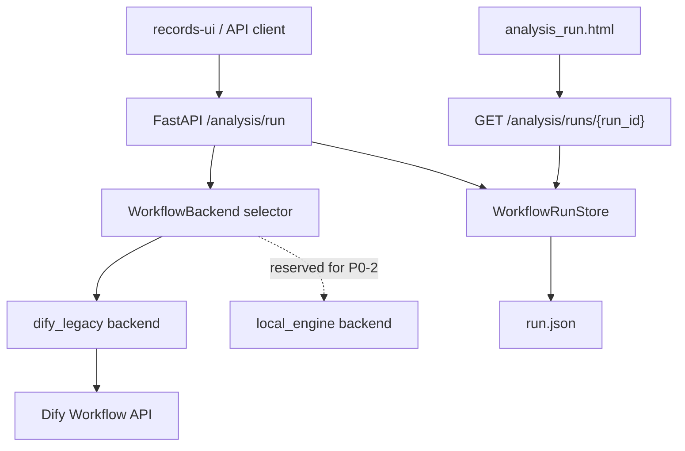
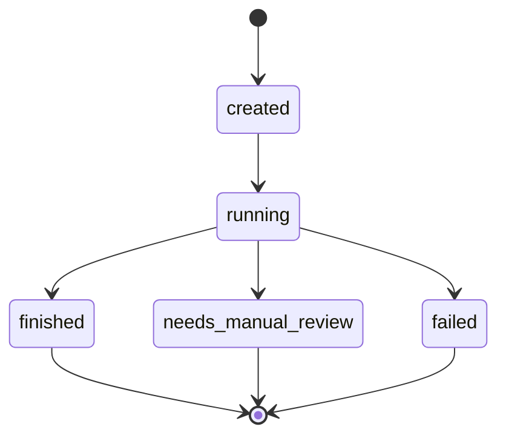
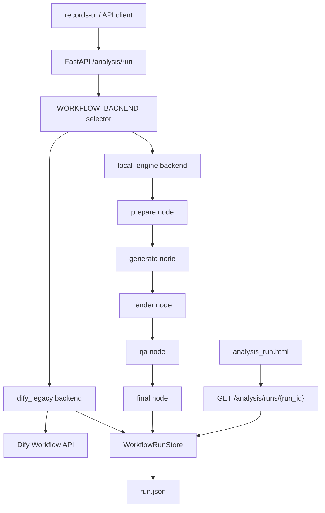
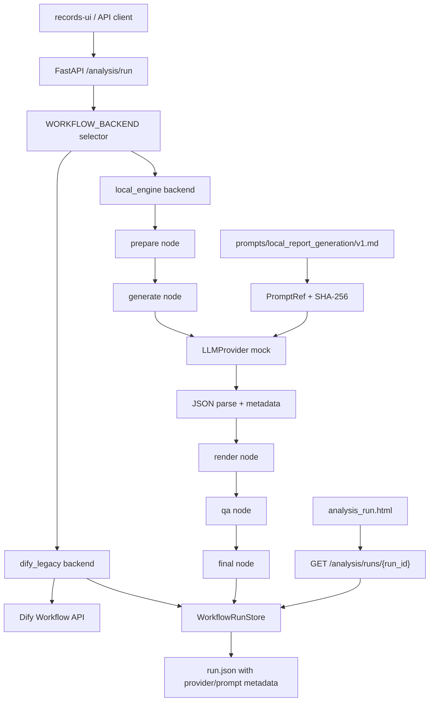
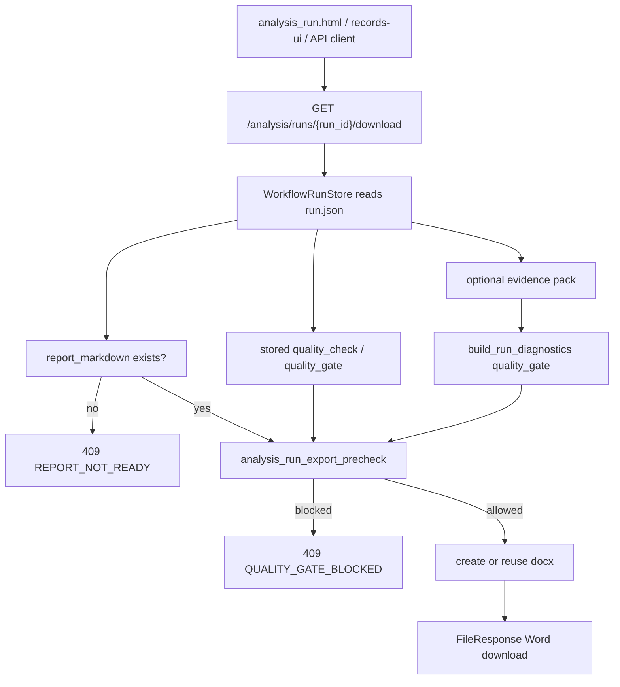

# Architecture Evolution

## P0-1 Planned Architecture

The existing FastAPI app remains the entry point. The records UI and analysis detail UI continue to call the same analysis APIs. P0-1 inserts a small workflow persistence module behind the existing analysis run read/write helpers and records that the active backend is `dify_legacy`.

### Added Modules

- `app/core/workflow/state.py`: workflow backend and run/node data shapes.
- `app/core/workflow/store.py`: JSON run store with atomic write.
- `app/core/workflow/__init__.py`: package exports.

### Unchanged Modules

- Static frontend pages remain under `app/static`.
- Dify workflow calling remains in `app/main.py`.
- Old URL analysis via `/analyze` remains unchanged.
- Report export remains unchanged.

### Data Flow

### State Flow

### Change From Previous Architecture

Before P0-1, analysis run JSON files were written directly from `app/main.py`. After P0-1, the same record shape is preserved but writes go through `WorkflowRunStore`, allowing atomic persistence and additive workflow metadata.

## P0-1 Actual State

Completed locally on 2026-07-06.

- The FastAPI entry point and static pages remain unchanged as architectural boundaries.
- `WorkflowRunStore` is the persistence boundary for analysis run JSON records.
- Run records preserve existing report fields and add `backend`, `workflow_backend`, `nodes`, timestamps, elapsed time, error, and artifact placeholders.
- `dify_legacy_workflow` is the single recorded node for the existing Dify-backed flow.
- `local_engine` remains reserved for P0-2 and is not executed in P0-1.
- No retry/cancel/resume, LLM provider abstraction, quality-gated export, or router split was added.

## P0-2 Actual State

Completed locally on 2026-07-06.

- The FastAPI entry point and static pages remain the same architectural boundary.
- `WORKFLOW_BACKEND` now selects either `dify_legacy` or `local_engine`; unset or unsupported values fall back to `dify_legacy`.
- `local_engine` runs in process and does not call Dify.
- The local workflow MVP records the serial node order `prepare`, `generate`, `render`, `qa`, and `final`.
- Local draft reports are persisted through the same analysis run JSON path as Dify legacy records.
- No full DAG runner, retry/cancel/resume controller, LLM provider, prompt hash, or export gate was added in this stage.

### P0-2 Data Flow

### P0-2 Change From P0-1

P0-1 only persisted workflow metadata for the existing Dify path. P0-2 adds a second backend implementation behind the same run API and persistence boundary. The local backend is deterministic and template based so that workflow execution can be tested without Dify credentials or live model calls.

## P0-3 Actual State

Completed locally on 2026-07-06.

- The FastAPI entry point, static pages, and JSON persistence boundary remain unchanged.
- `app/core/llm` is now the local single-model-call boundary.
- `local_engine` calls `LLMProvider.generate()` during the `generate` node.
- The default local provider is deterministic `mock`, so P0-3 tests do not need network calls, tokens, or provider secrets.
- Prompt files are versioned under `prompts/<prompt_name>/<version>.md`.
- Local run records now include `llm_provider`, `llm_model`, `prompt_ref`, `prompt_sha256`, `prompt_refs`, and `model_calls`.
- Invalid provider JSON becomes a `LLM_JSON_PARSE_ERROR` quality issue and a `needs_manual_review` local run result.
- The legacy Dify path remains a workflow backend and is not represented as an `LLMProvider`.
- No export gate, retry/cancel/resume controller, memory schema, or router split was added in this stage.

### P0-3 Data Flow

### P0-3 Change From P0-2

P0-2 proved that the local workflow could run serial nodes without Dify. P0-3 adds the model-call boundary inside that local workflow and makes prompt content traceable through SHA-256 metadata. The Dify-backed path remains unchanged as the default workflow backend unless `WORKFLOW_BACKEND=local_engine` is configured.

## P0-4 Actual State

Completed locally on 2026-07-06.

- The FastAPI entry point and static pages remain the user-facing boundary.
- `app/core/quality` is now the reusable quality export-precheck boundary.
- Analysis-run report viewing remains available for finished and manual-review runs.
- `/analysis/runs/{run_id}/download` runs quality precheck before creating or returning a Word file.
- The precheck blocks failed `quality_check`, failed/manual-review `quality_gate`, and diagnostics-derived manual-review gates.
- When the evidence pack is readable, the download path recomputes the existing diagnostics quality gate before export.
- Static pages disable download buttons when the current report state is quality-blocked.
- No dashboard, broad QA rewrite, Dify configuration change, deployment change, or frontend build system was added.

### P0-4 Data Flow

### P0-4 Change From P0-3

P0-3 recorded provider and prompt metadata but did not stop unsafe reports from being exported. P0-4 keeps generation and review behavior unchanged, but makes Word export conditional on the run's quality state at the final download boundary.
