# Architecture Evolution

## P0-1 Planned Architecture

The existing FastAPI app remains the entry point. The records UI and analysis detail UI continue to call the same analysis APIs. P0-1 inserts a small workflow persistence module behind the existing analysis run read/write helpers and records that the active backend is `dify_legacy`.

### Added Modules

- `app/core/workflow/state.py`: workflow backend and run/node data shapes.
- `app/core/workflow/store.py`: JSON run store with atomic write.
- `app/core/workflow/__init__.py`: package exports.

### Unchanged Modules

- Static frontend pages remain under `app/static`.
- Dify workflow calling remains in `app/main.py`.
- Old URL analysis via `/analyze` remains unchanged.
- Report export remains unchanged.

### Data Flow

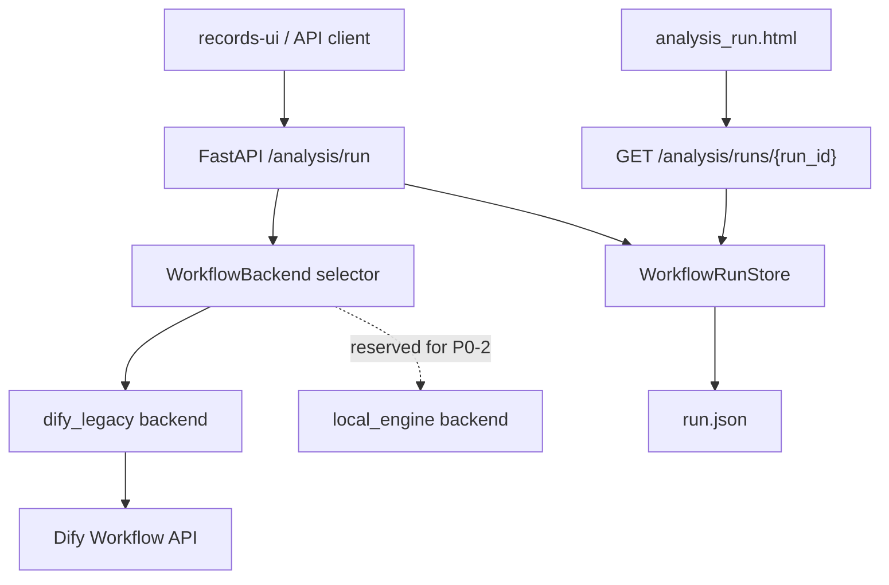

### State Flow

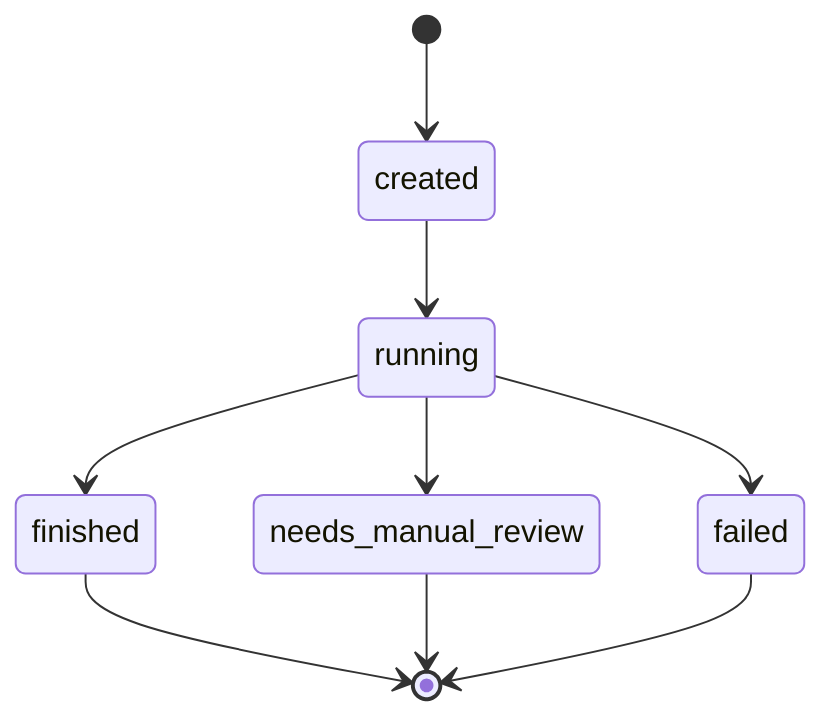

### Change From Previous Architecture

Before P0-1, analysis run JSON files were written directly from `app/main.py`. After P0-1, the same record shape is preserved but writes go through `WorkflowRunStore`, allowing atomic persistence and additive workflow metadata.

## P0-1 Actual State

Completed locally on 2026-07-06.

- The FastAPI entry point and static pages remain unchanged as architectural boundaries.
- `WorkflowRunStore` is the persistence boundary for analysis run JSON records.
- Run records preserve existing report fields and add `backend`, `workflow_backend`, `nodes`, timestamps, elapsed time, error, and artifact placeholders.
- `dify_legacy_workflow` is the single recorded node for the existing Dify-backed flow.
- `local_engine` remains reserved for P0-2 and is not executed in P0-1.
- No retry/cancel/resume, LLM provider abstraction, quality-gated export, or router split was added.

## P0-2 Actual State

Completed locally on 2026-07-06.

- The FastAPI entry point and static pages remain the same architectural boundary.
- `WORKFLOW_BACKEND` now selects either `dify_legacy` or `local_engine`; unset or unsupported values fall back to `dify_legacy`.
- `local_engine` runs in process and does not call Dify.
- The local workflow MVP records the serial node order `prepare`, `generate`, `render`, `qa`, and `final`.
- Local draft reports are persisted through the same analysis run JSON path as Dify legacy records.
- No full DAG runner, retry/cancel/resume controller, LLM provider, prompt hash, or export gate was added in this stage.

### P0-2 Data Flow

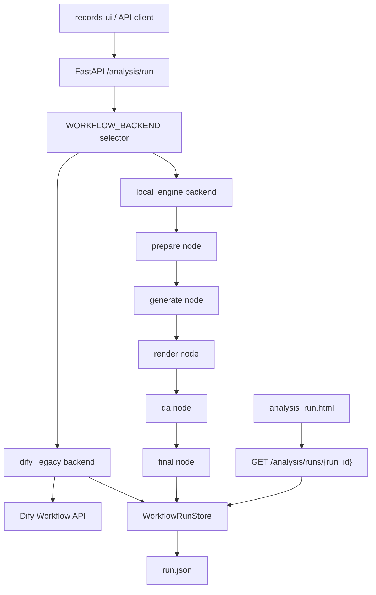

### P0-2 Change From P0-1

P0-1 only persisted workflow metadata for the existing Dify path. P0-2 adds a second backend implementation behind the same run API and persistence boundary. The local backend is deterministic and template based so that workflow execution can be tested without Dify credentials or live model calls.

## P0-3 Actual State

Completed locally on 2026-07-06.

- The FastAPI entry point, static pages, and JSON persistence boundary remain unchanged.
- `app/core/llm` is now the local single-model-call boundary.
- `local_engine` calls `LLMProvider.generate()` during the `generate` node.
- The default local provider is deterministic `mock`, so P0-3 tests do not need network calls, tokens, or provider secrets.
- Prompt files are versioned under `prompts/<prompt_name>/<version>.md`.
- Local run records now include `llm_provider`, `llm_model`, `prompt_ref`, `prompt_sha256`, `prompt_refs`, and `model_calls`.
- Invalid provider JSON becomes a `LLM_JSON_PARSE_ERROR` quality issue and a `needs_manual_review` local run result.
- The legacy Dify path remains a workflow backend and is not represented as an `LLMProvider`.
- No export gate, retry/cancel/resume controller, memory schema, or router split was added in this stage.

### P0-3 Data Flow

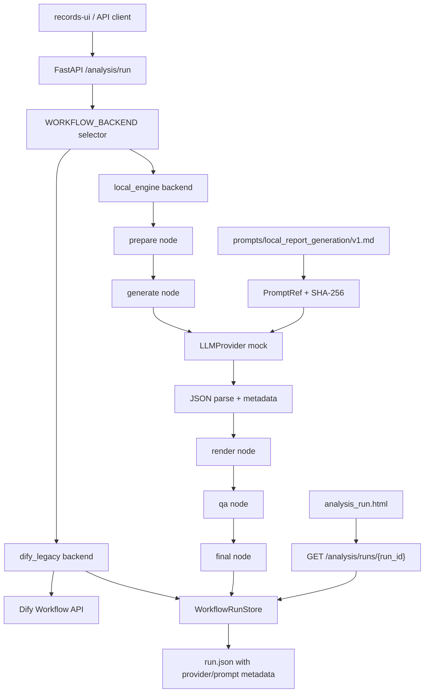

### P0-3 Change From P0-2

P0-2 proved that the local workflow could run serial nodes without Dify. P0-3 adds the model-call boundary inside that local workflow and makes prompt content traceable through SHA-256 metadata. The Dify-backed path remains unchanged as the default workflow backend unless `WORKFLOW_BACKEND=local_engine` is configured.

## P0-4 Actual State

Completed locally on 2026-07-06.

- The FastAPI entry point and static pages remain the user-facing boundary.
- `app/core/quality` is now the reusable quality export-precheck boundary.
- Analysis-run report viewing remains available for finished and manual-review runs.
- `/analysis/runs/{run_id}/download` runs quality precheck before creating or returning a Word file.
- The precheck blocks only not-ready reports without an exportable body; failed QA and manual-review gates remain visible as diagnostics but do not block explicit Word download.
- When the evidence pack is readable, the download path recomputes the existing diagnostics quality gate before export so the Word path can surface current warnings.
- Static pages keep download buttons available for manual-review reports with report Markdown; users still need an explicit download action.
- No dashboard, broad QA rewrite, Dify configuration change, deployment change, or frontend build system was added.

### P0-4 Data Flow

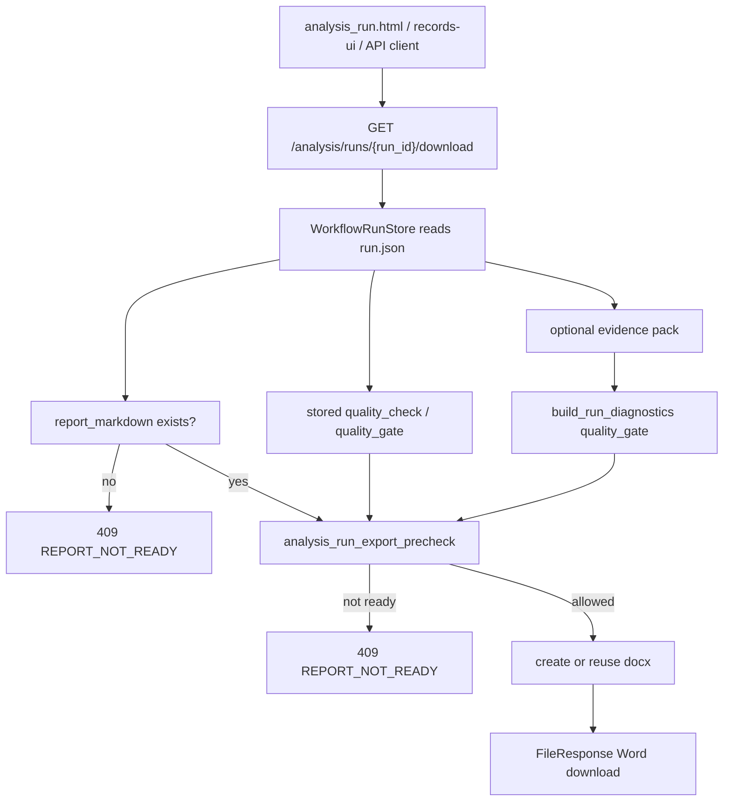

### P0-4 Change From P0-3

P0-3 recorded provider and prompt metadata but did not make export diagnostics reusable. P0-4 keeps generation and review behavior unchanged, runs a reusable precheck at the final download boundary, preserves quality warnings, and allows explicit Word download for manual-review reports that have a report body.

## P1-1 Actual State

Completed locally on 2026-07-07.

- `app/core/memory` is the structured memory boundary for `MemoryItem` v1.
- Structured memory is stored in JSON under the existing memory directory as `memory_items.json`.
- The existing legacy `report_memory.md` file remains supported.
- `/memory/items` lists structured memory items.
- `/memory/items/{item_id}` upserts a structured memory item and uses the existing memory write-token rule.
- `/analysis/run` reads the evidence pack before resolving report memory so scoped memory can match current primary and auxiliary materials.
- Only approved, explicitly scoped memory items are injected.
- Injected structured items are appended under `# Structured Memory Items`, separated from current evidence, and marked as guidance only.
- Run records expose `used_memory_ids`, `memory_item_count`, `memory_item_chars`, and `memory_items_read_failed`.
- No Dify configuration, production deployment, vector search, audit workflow, or broad UI rebuild was added.

### P1-1 Data Flow

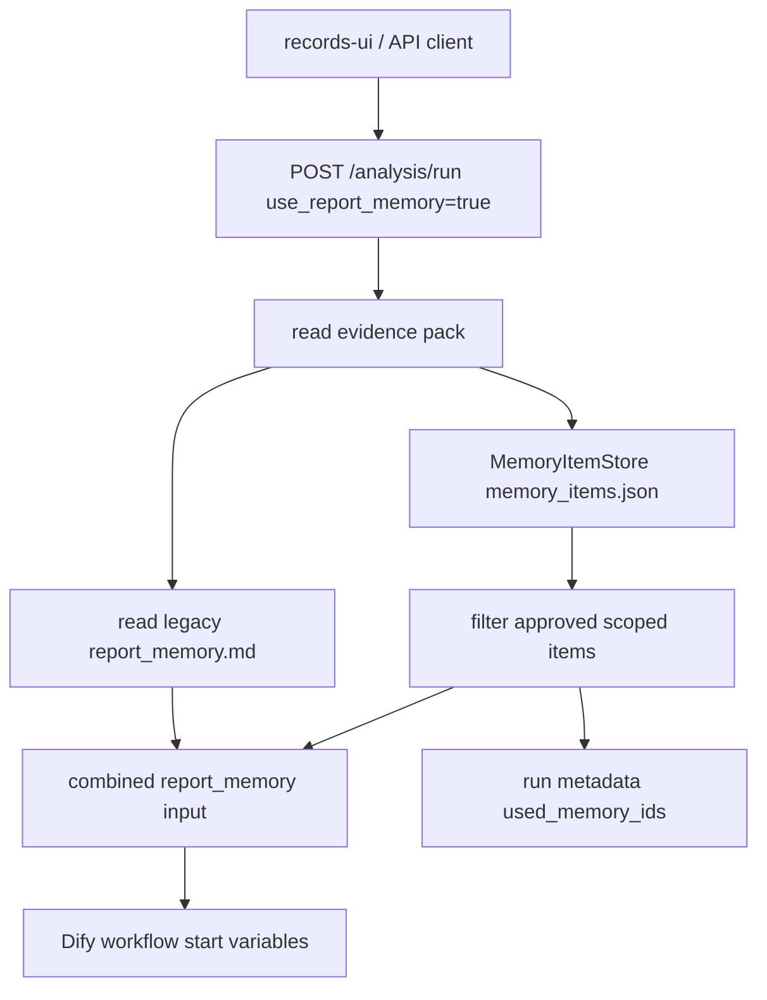

### P1-1 Change From P0-4

P0-4 focused on Word download behavior and quality diagnostics. P1-1 leaves that path unchanged and adds structured, opt-in writing guidance that is traceable per run and explicitly separated from factual evidence.

## P1-2 Actual State

Completed locally on 2026-07-07.

- `scripts/run_quality_smoke.py` is the offline smoke evaluation boundary.
- `tests/eval_fixtures` contains 3 fixed smoke cases: deliverable analysis, summary-only report, and unsupported fact.
- The runner reuses `app.diagnostics.build_run_diagnostics` for source fidelity, coverage, analysis depth, quality gate, and diagnosis codes.
- The runner writes `quality_smoke_summary.json` and `quality_smoke_report.md`.
- Smoke metrics include deliverable/manual-review/failed counts, deliverable rate, coverage, analysis depth, unsupported facts, summary-only risk, blocking issue counts, and diagnosis counts.
- Default output goes under ignored `reports/` paths when no output directory is provided.
- No FastAPI endpoint, UI dashboard, live Dify call, production deployment, or server configuration change was added.

### P1-2 Data Flow

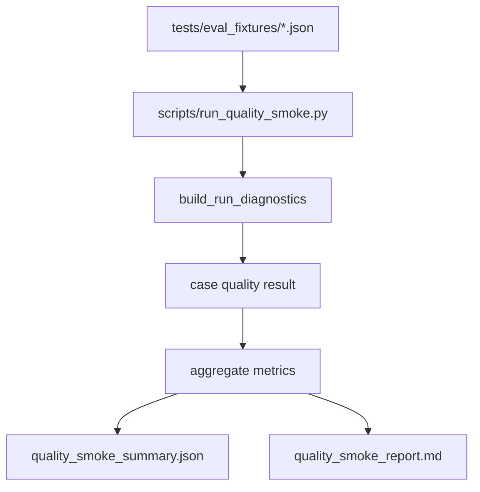

### P1-2 Change From P1-1

P1-1 made memory usage traceable per run. P1-2 adds a repeatable local quality loop so future prompt, workflow, memory, and evidence changes can be checked against fixed smoke cases before any live-environment comparison.

## P1-3 Actual State

Completed locally on 2026-07-07.

- `app/core/evidence` is the Evidence Pack v3 lite annotation boundary.
- Database-selected evidence packs keep the existing construction flow and `pack_version: 2.0` compatibility.
- Newly generated database packs add `evidence_schema_version: 3_lite`, `evidence_schema`, `evidence_items`, and pack-level `parse_risks`.
- Material key facts, important passages, attachments, attachment key facts/sections, and table summaries receive `evidence_id`, coarse `source_span`, `confidence`, and `parse_risks` where applicable.
- Coarse spans use metadata fields, paragraph/paragraph ranges, attachment chunks, attachment summaries, and sheet/row ranges.
- Dify compact packs keep lightweight inline evidence fields and `evidence_item_count`, but do not include the full `evidence_items` index.
- No Dify workflow, production deployment, server config, secret, frontend build system, or broad route/module refactor was changed.

### P1-3 Data Flow

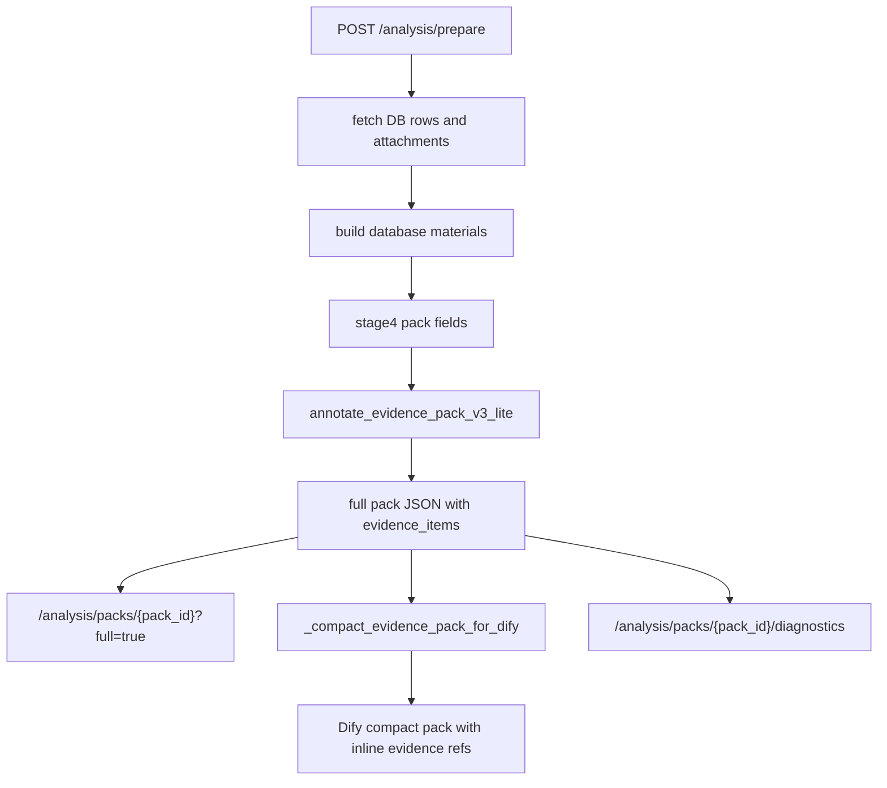

### P1-3 Change From P1-2

P1-2 added repeatable quality smoke metrics. P1-3 uses that runner as a drift check while adding source traceability to generated packs. The main runtime behavior remains the same: users still prepare packs, start report runs, inspect diagnostics, and explicitly download Word reports.

## P2-1 Actual State

Completed locally on 2026-07-07.

- The FastAPI entry point and JSON run store remain the workflow boundary.
- `/analysis/run` now delegates run creation to a shared internal helper so retry/resume use the same pack read, memory resolution, backend selection, run persistence, and background execution path.
- `/analysis/runs/{run_id}/cancel` is state-checked and only accepts `created` or `running` runs. It marks the run `cancelled`, stores `cancel_requested`, `cancelled_at`, and a `control_events` entry, and relies on the existing late-result guard to ignore background results after the state change.
- `/analysis/runs/{run_id}/retry` is state-checked and only accepts `failed` runs. It creates a new linked run with `retry_of=<source_run_id>` and updates the source with `retried_by=<new_run_id>`.
- `/analysis/runs/{run_id}/resume` is state-checked and only accepts `cancelled` runs. It creates a new linked run with `resume_of=<source_run_id>` and updates the source with `resumed_by=<new_run_id>`.
- Invalid state transitions return `RUN_OPERATION_NOT_ALLOWED`.
- No queue platform, remote Dify cancellation call, idempotency/recovery policy, frontend control UI, deployment, or production configuration change was added.

### P2-1 Data Flow

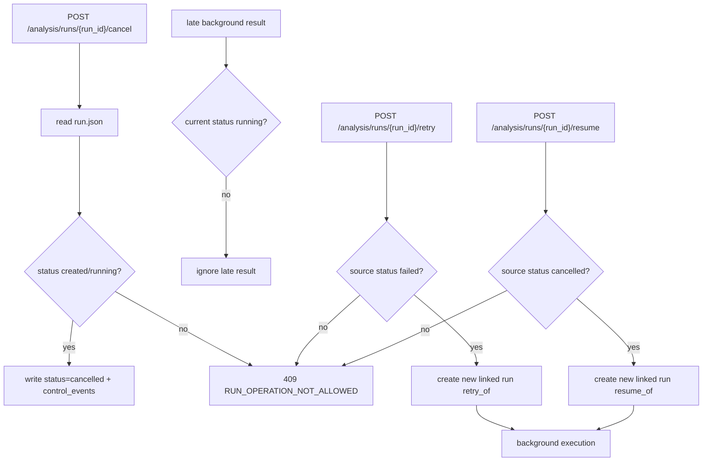

### P2-1 Change From P1-3

P1-3 made evidence packs traceable. P2-1 does not change pack construction or report quality logic; it adds a small run-control layer around the existing background execution path and keeps duplicate suppression/recovery for P2-2.

## P2-2 Actual State

Completed locally on 2026-07-07.

- `WorkflowRunStore` can list valid `run_*.json` records and skips corrupt/non-run files during scans.
- `/analysis/run` computes an `input_hash` from the pack ID, workflow backend, report-memory flag, report-memory hash, and selected structured memory item IDs.
- Normal analysis-run creation is protected by a process-local creation lock. If an active `created` or `running` run with the same `input_hash` exists, the API returns that existing run and records `idempotency_duplicate_count`, `last_duplicate_at`, and an `idempotency_reuse` control event.
- Retry and resume continue to create linked new runs; they are control actions rather than duplicate normal submissions.
- Startup recovery and normal run creation both scan stale active runs. Stale pending records are marked `failed` with `RUN_RECOVERED_STALE_PENDING`, `recovery_reason=stale_pending_run`, `recovered_at`, and a `startup_recovery` control event.
- Dify and local workflow completion now merge results into the latest persisted run record so duplicate counters and control metadata written during execution are preserved.
- No queue service, database migration, distributed lock, Dify workflow change, deployment, production configuration change, or UI rebuild was added.

### P2-2 Data Flow

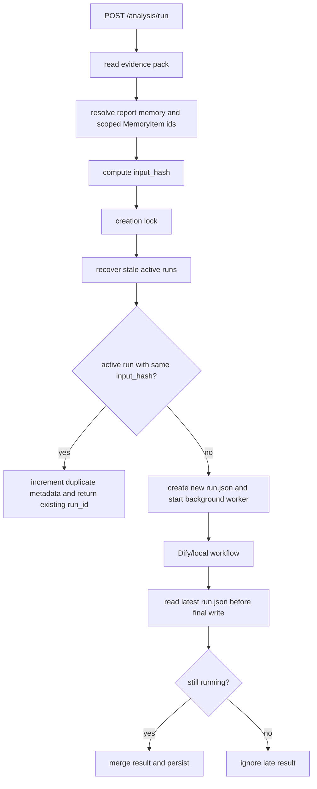

### P2-2 Change From P2-1

P2-1 added explicit user controls for individual runs. P2-2 adds guardrails around run creation and service restarts: identical active submissions reuse one run, and stale pending JSON state becomes visible as failed/retryable state instead of remaining indefinitely active.

## P2-2.5 Actual State

Completed locally on 2026-07-07.

- `app/material_compression_cache.py` owns the local SQLite repository, schemas, stable cache keys, source/attachment/options hashes, status transitions, corrupt/stale/building-timeout handling, and build-run records.
- `app/material_compressor.py` owns deterministic v1 view builders for `material/full`, `primary/light`, `primary/safe`, and `auxiliary/summary`.
- `/analysis/prepare` reads only `material/full` when `MATERIAL_COMPRESSION_CACHE_ENABLED=true`; cache misses, stale rows, corrupt payloads, failed rows, building rows, and force refresh fall back to dynamic construction.
- Cache hits are still passed through current request role context so `material_role`, primary-specific fields, auxiliary relation/relevance/snippets, and stage4 pack fields match the current selection.
- Pack diagnostics expose `material_cache_stats` and diagnosis codes for cache hit/fallback/unsafe states.
- `records.html` adds selected-material cache check/build buttons. These call `/analysis/material-cache/check` and `/analysis/material-cache/build` only for current selections and do not perform per-row cache checks in `/records`.
- `scripts/prebuild_material_compression_cache.py` provides a local-safe option parser and dry-run entry for scheduled prebuild shape.
- Dify compact packs and report/Word content do not include `material_cache` implementation fields.
- No company DB schema deployment, final evidence-pack cache, independent attachment/table cache rows, resident scheduler, production deployment, Dify workflow, or secret/config change was added.

### P2-2.5 Data Flow

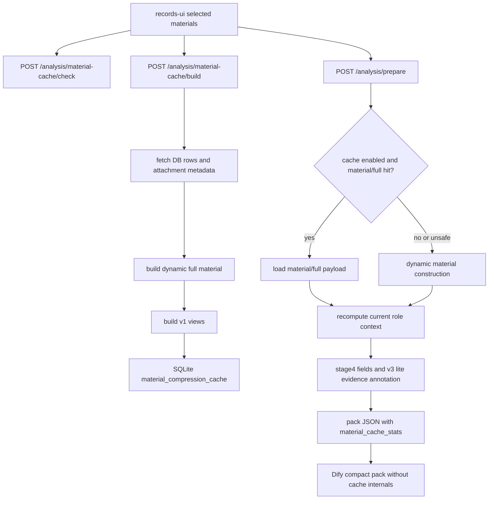

### P2-2.5 Change From P2-2

P2-2 made run creation idempotent and recoverable. P2-2.5 applies the same conservative persistence posture to material preparation: cache rows are derived, versioned, optional, and bypassed whenever unsafe, so prepare can speed up without making cache state the source of truth.

## P2-3 Actual State

Completed locally on 2026-07-08.

- `/health/db` reports database configuration without passwords. It performs a live `SELECT 1` only when `check=true` is supplied.
- `/health/llm` reports the selected workflow backend, Dify workflow configuration presence, and local provider availability without exposing API keys.
- `/health/storage` reports bounded snapshots of local report files, site cache, attachment parse cache, database evidence packs, analysis run JSON files, and the material compression cache database path.
- `/ops/cleanup` cleans only generated Word reports and expired attachment parse-cache JSON files. It defaults to dry-run and enforces a `max_delete` limit.
- `/ops/diagnostics` combines storage snapshots, pack/run JSON counts, dependency configuration summaries, and cleanup capabilities.
- `/ops-diagnostics-ui` is a small static page that reads `/ops/diagnostics`.
- No evidence pack deletion, analysis run deletion, live Dify health call, production deployment, server config change, or BI dashboard was added.

### P2-3 Data Flow

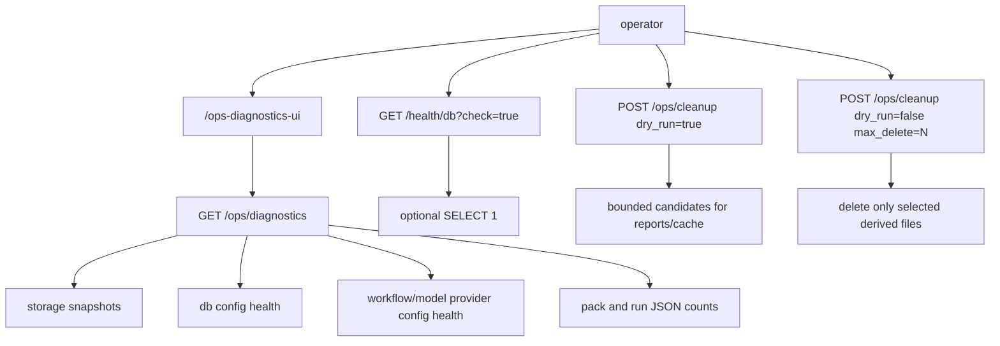

### P2-3 Change From P2-2.5

P2-2.5 added a derived material cache. P2-3 exposes the operational state around that cache and the existing local JSON/filesystem stores, while keeping cleanup conservative and read-mostly by default.
